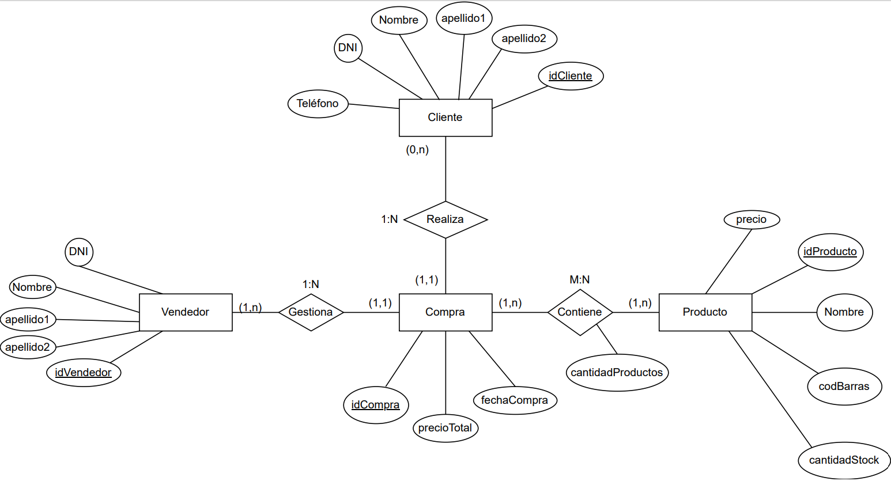
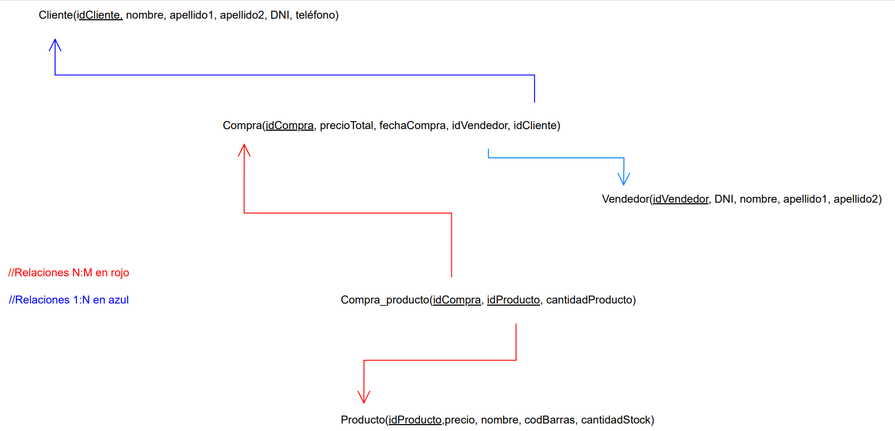

# api-almacen-dbcp2-database-connection
  
 
El repositorio engloba un proyecto maven conectado a la base de datos desarrollada en phpMyAdmin, de un almacén, gracias a un MariaDB JDBC Driver. Este proyecto me ayuda a aprender, practicar y afianzar las bases de desarrollo de bases de datos, al igual que conceptos más avanzados como pools de conexiones y métodos CRUD.

Existen dos directorios importantes en este repositorio:
- **bd**: Es donde se encuentra toda la información de la creación de la base de datos, el modelo entidad-relación, el modelo relacional y el diseñador
- **AppAlmacen2**: Es donde se encuentra el código de nuestra api

---
## BASE DE DATOS

### Tablas:
- Cliente

| # | Nombre | Tipo | Nulo | Extra | Key |
|----------|----------|----------|----------|----------|----------|
| 1 | idCliente    | int(50)   | No   | AUTO_INCREMENT | Primary Key |
| 2 | nombre    | varchar(250)   | No   |   |   |
| 3 | apellido1    | varchar(250)   | No   |   |   |
| 4 | apellido2    | varchar(250)   | Sí   |   |   |
| 5 | dni    | varchar(9)   | No   |   |   |
| 6 | telefono    | varchar(12)   | No   |   |   |
---

- Compra

| # | Nombre | Tipo | Nulo | Extra | Key |
|----------|----------|----------|----------|----------|----------|
| 1 | idCompra    | int(50)   | No   | AUTO_INCREMENT | Primary Key |
| 2 | precioTotal    | float   | No   |   |   |
| 3 | fechaCompra    | datetime   | No   |   |   |
| 4 | idCliente    | int(50)   | No   |   | Foreign Key  |
| 5 | idVendedor    | int(50)   | No   |   | Foreign Key  |
---

- Detalles/Compra_Producto

| # | Nombre | Tipo | Nulo | Extra | Key |
|----------|----------|----------|----------|----------|----------|
| 1 | cantidadProducto    | int(50)   | No   |  |  |
| 2 | idCompra    | int(50)   | No   |   | Foreign Key  |
| 3 | idProducto    | int(50)   | No   |   | Foreign Key  |
---

- Producto

| # | Nombre | Tipo | Nulo | Extra | Key |
|----------|----------|----------|----------|----------|----------|
| 1 | idProducto    | int(50)   | No   | AUTO_INCREMENT | Primary Key |
| 2 | precio    | float   | No   |   |   |
| 3 | nombre    | varchar(250)   | No   |   |   |
| 4 | codBarras    | varchar(15)   | No   |   | Foreign Key  |
| 5 | cantidadStock    | int(50)   | No   |   | Foreign Key  |
---

- Vendedor

| # | Nombre | Tipo | Nulo | Extra | Key |
|----------|----------|----------|----------|----------|----------|
| 1 | idVendedor    | int(50)   | No   | AUTO_INCREMENT | Primary Key |
| 2 | dni    | varchar(50)   | No   |   |   |
| 3 | nombre    | varchar(250)   | No   |   |   |
| 4 | apellido1    | varchar(250)   | No   |   | Foreign Key  |
| 5 | apellido2    | varchar(250)   | Sí   |   | Foreign Key  |
---

## Modelo entidad-relación

---
## Modelo relacional

---
## Diseñador phpMyAdmin

